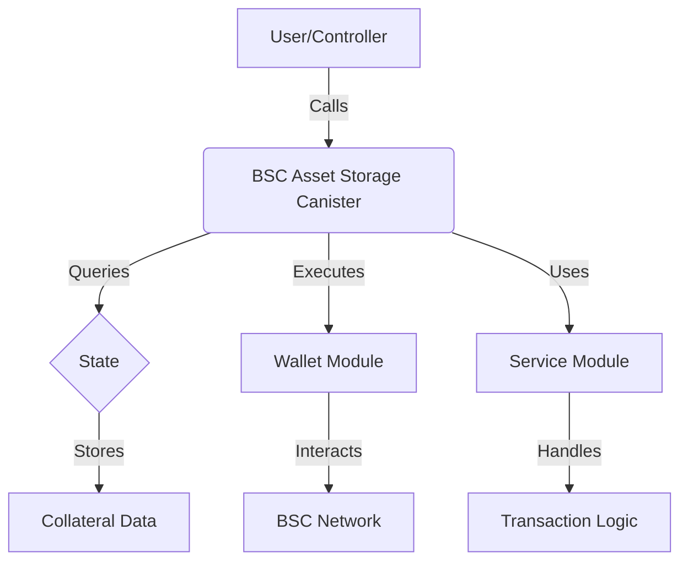

# BSC Asset Storage Canister

This canister securely stores BNB and BEP-20 tokens as collateral for the BIT10 Index Funds on the Binance Smart Chain (BSC).

## 🌟 Overview

The BIT10 BSC Asset Storage Canister is a secure, decentralized storage solution for BNB and BEP-20 tokens, designed to support the BIT10 Index Fund ecosystem. It ensures safe custody, transparent operations, and seamless integration with other components of the BIT10 platform.

## 🌐 Core Features

- Secure storage of BNB and BEP-20 tokens
- Controller-based access management
- On-chain balance queries
- Transaction execution for BNB transfers
- Extensible for additional BEP-20 token support

## 📐 Architecture Overview



<!-- ## 🔗 ICP Canisters

- BSC Asset Storage: [cj5gs-xiaaa-aaaap-qp3cq-cai](https://a4gq6-oaaaa-aaaab-qaa4q-cai.raw.icp0.io/?id=cj5gs-xiaaa-aaaap-qp3cq-cai) -->

## 🏁 Getting Started

To start using BIT10 BSC Asset Storage canister, follow these steps:

1. **Clone the Repository**:
    ```bash
    git clone https://github.com/ZeyaRabani/BIT10.git
    ```

2. **Go to bsc_asset_storage folder**:
    ```bash
    cd asset_storage/bsc_asset_storage
    ```

3. **Start the dfx locally and run the canister**:
    ```bash
    dfx start --background

    dfx deploy bsc_asset_storage_backend --argument '(opt record {bsc_network = opt variant {BscMainnet}; ecdsa_key_name = opt variant {TestKeyLocalDevelopment}})'
    ```