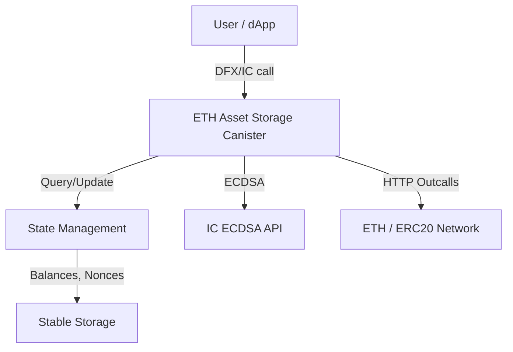

# ETH Asset Storage Canister

This canister securely stores ETH and ERC20 tokens as collateral for the BIT10 Index Funds. It provides programmatic access to deposit, withdraw, and manage Ethereum-based assets on the Internet Computer.

## 🌟 Overview

The BIT10 ETH Asset Storage Canister acts as a bridge between the Internet Computer and the Ethereum network, enabling secure custody and management of ETH and ERC20 tokens for DeFi and collateralization use cases.

## 🌐 Core Features

- Store and manage ETH and ERC20 tokens
- Generate Ethereum addresses for principals
- Query balances and transaction counts
- Send ETH and ERC20 tokens programmatically
- Secure access control (controller-only operations)

## 📐 Architecture Overview



### 🛠️ System Components

- Canister: Main logic for asset management and Ethereum interaction
- State Management: Tracks balances, nonces, and user mappings
- ECDSA API: Used for signing Ethereum transactions
- HTTP Outcalls: Communicates with Ethereum nodes
- Stable Storage: Persists critical data across upgrades

<!-- ## 🔗 ICP Canisters

- ETH Asset Storage Sepolia Testnet: [zkrig-uqaaa-aaaap-qkmiq-cai](https://a4gq6-oaaaa-aaaab-qaa4q-cai.raw.icp0.io/?id=zkrig-uqaaa-aaaap-qkmiq-cai)
- ETH Asset Storage: [2bh6f-siaaa-aaaap-qkmca-cai](https://a4gq6-oaaaa-aaaab-qaa4q-cai.raw.icp0.io/?id=2bh6f-siaaa-aaaap-qkmca-cai) -->

## 🏁 Getting Started

To start using BIT10 ETH Asset Storage canister, follow these steps:

1. **Clone the Repository**:
    ```bash
    git clone https://github.com/ZeyaRabani/BIT10.git
    ```

2. **Go to eth_asset_storage folder**:
    ```bash
    cd asset_storage/eth_asset_storage
    ```

3. **Start the dfx locally and run the canister**:
    ```bash
    dfx start --background

    dfx deploy eth_asset_storage --argument '(opt record {ethereum_network = opt variant {Sepolia}; ecdsa_key_name = opt variant {TestKeyLocalDevelopment}})'
    ```