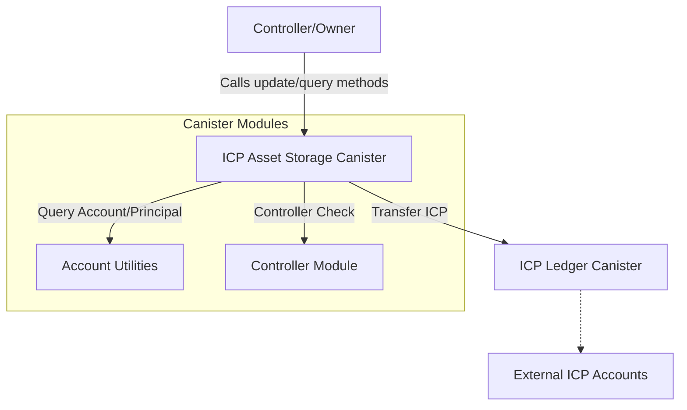

# ICP Asset Storage Canister

A secure, controller-managed canister for storing and transferring ICP tokens as collateral for the BIT10 Index Funds.

## 🌟 Overview

The BIT10 ICP Asset Storage Canister is designed to securely hold and manage ICP tokens, acting as a vault for index fund collateralization. All operations are strictly controlled by the canister controller, ensuring maximum security and compliance.

## 🌐 Core Features

- Controller-Only Access: All methods are protected and can only be called by the canister controller.
- ICP Transfers: Securely transfer ICP tokens to specified principals and subaccounts.
- Account Utilities: Query canister account details and special principal addresses.
- Security: Robust error handling and no sensitive data leakage.

## 📐 Architecture Overview



<!-- ## 🔗 ICP Canisters

- **ICP Asset Storage:** [`yymp3-uaaaa-aaaap-qklqa-cai`](https://a4gq6-oaaaa-aaaab-qaa4q-cai.raw.icp0.io/?id=yymp3-uaaaa-aaaap-qklqa-cai) -->

## 🏁 Getting Started

To start using BIT10 ICP Asset Storage canister, follow these steps:

1. **Clone the Repository**:
    ```bash
    git clone https://github.com/ZeyaRabani/BIT10.git
    ```

2. **Go to icp_asset_storage folder**:
    ```bash
    cd asset_storage/icp_asset_storage
    ```

3. **Start the dfx locally and run the canister**:
    ```bash
    dfx start --background

    dfx deploy icp_asset_storage
    ```