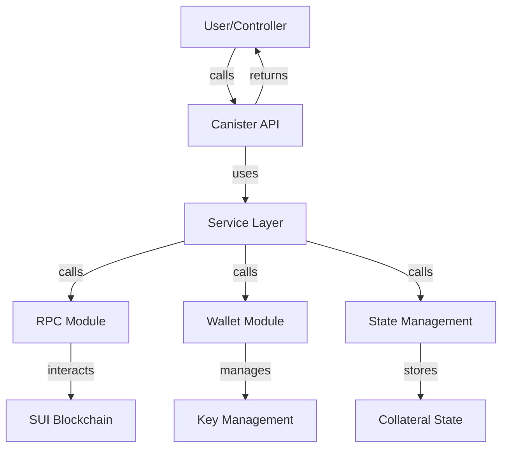

# SUI Asset Storage Canister

This canister securely manages and stores SUI tokens as collateral for the BIT10 Index Fund, enabling decentralized, trustless, and auditable SUI asset management on the Internet Computer.

## 🌟 Overview

The BIT10 SUI Collateral Storage Canister is a smart contract designed to hold and manage SUI tokens as collateral for the BIT10 Index Fund. It provides secure storage, transfer, and balance query functionalities, leveraging ECDSA signatures and robust access control.

## 🌐 Core Features

- Secure SUI Storage: Safely holds SUI tokens as collateral.
- On-chain Transfers: Enables sending SUI to specified addresses.
- Balance Queries: Retrieve SUI balances for any address.
- Access Control: Only authorized controllers can perform sensitive operations.
- Network Flexibility: Supports different SUI networks (Devnet, Testnet, Mainnet).

## 📐 Architecture Overview



## 🛠️ System Components

- API Layer: Exposes update/query methods for SUI operations.
- Service Layer: Implements business logic for SUI transfers, balance checks, etc.
- RPC Module: Handles communication with the SUI blockchain.
- Wallet Module: Manages SUI wallet operations and ECDSA keys.
- State Management: Maintains collateral and configuration state.

<!-- ## 🔗 ICP Canisters

- SUI Asset Storage: []() -->


## 🏁 Getting Started

To start using BIT10 SUI Asset Storage canister, follow these steps:

1. **Clone the Repository**:
    ```bash
    git clone https://github.com/ZeyaRabani/BIT10.git
    ```

2. **Go to sui_asset_storage folder**:
    ```bash
    cd asset_storage/sui_asset_storage
    ```

3. **Start the dfx locally and run the canister**:
    ```bash
    dfx start --background

    dfx deploy sui_asset_storage_backend --argument '(opt record { sui_network = opt variant {Devnet}; ecdsa_key_name = opt variant {TestKeyLocalDevelopment} })'
    ```