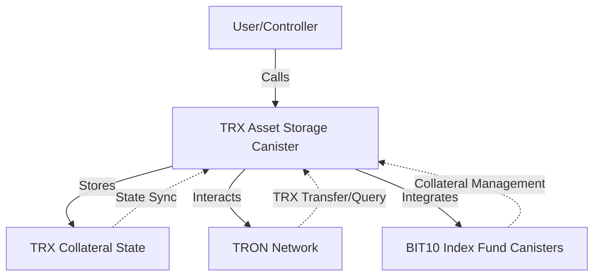

# TRX Asset Storage Canister

This canister securely stores TRON (TRX) tokens as collateral for the BIT10 Index Fund, enabling decentralized, multi-chain asset management and seamless integration with the Internet Computer ecosystem.

## 🌟 Overview

The BIT10 TRX Collateral Storage Canister is a smart contract deployed on the Internet Computer (IC) that manages TRON (TRX) assets as collateral for the BIT10 Index Fund. It provides secure, decentralized custody and facilitates cross-chain operations between TRON and the IC.

## 🌐 Core Features

- Secure storage of TRX tokens as collateral
- Decentralized, multi-chain asset management
- Cross-chain TRX transfers and balance queries
- Controller-based access management
- Designed for seamless integration with other BIT10 canisters

## 📐 Architecture Overview



### 🛠️ System Components

- TRX Asset Storage Canister: Manages TRX collateral and exposes APIs for deposit, withdrawal, and balance queries.
- TRX Collateral State: Stores the state of TRX assets and related metadata.
- TRON Network: External blockchain for TRX transactions.

<!-- ## 🔗 ICP Canisters

- TRX Asset Storage: []() -->

## 🏁 Getting Started

To start using BIT10 TRX Asset Storage canister, follow these steps:

1. **Clone the Repository**:
    ```bash
    git clone https://github.com/ZeyaRabani/BIT10.git
    ```

2. **Go to trx_asset_storage folder**:
    ```bash
    cd asset_storage/trx_asset_storage
    ```

3. **Start the dfx locally and run the canister**:
    ```bash
    dfx start --background

    dfx deploy trx_asset_storage_backend --argument '(opt record { tron_network = opt variant {Nile}; ecdsa_key_name = opt variant {TestKeyLocalDevelopment} })'
    ```