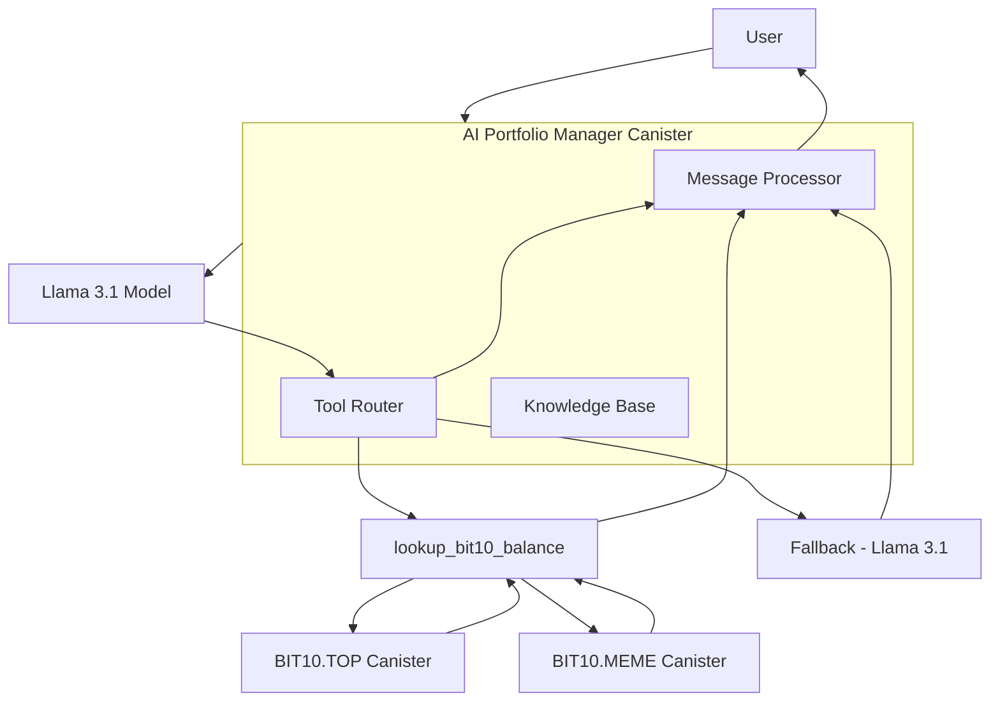

# AI Portfolio Manager Canister

The AI Portfolio Manager Canister is built on the Internet Computer (IC). Its core functionality leverages an integrated Large Language Model (LLM) to answer user queries about BIT10 index funds and retrieve real-time balance information for specific tokens and addresses.

## 🌟 Overview

The AI assistant is designed to be concise, factual, and strictly adhere to predefined knowledge and operational rules, ensuring a secure and predictable interaction for users managing their BIT10 holdings.

## 🌐 Core Features

- LLM-Powered Interaction: Utilizes the Llama 3.1 model (via `ic-llm`) for natural language understanding and generation.
- BIT10 Knowledge Base: Answers questions about BIT10's offerings, including its index funds (Test BIT10.TOP, Test BIT10.MEME), services, and security.
- On-Chain Balance Lookup: Can retrieve the balance of Test BIT10.TOP and Test BIT10.MEME tokens for any provided ICP principal (address) by calling other canisters.
- Robust Input Validation: Ensures that user-provided addresses are valid ICP principals before attempting any on-chain lookups.
- Controlled Tool Execution: Strictly governs when the LLM is allowed to call external tools (like balance lookups), preventing unsolicited or inappropriate API calls.
- Contextual Response Generation: Adapts responses based on user intent, providing direct answers from its knowledge base or executing tool calls as needed.
- Security Focus: Hardcoded target canister IDs and strict parameter validation minimize potential attack vectors.

## 📐 Architecture Overview



## 🔗 ICP Canisters

- BIT10 AI Portfolio Manager: [anic3-viaaa-aaaap-qqcaq-cai](https://a4gq6-oaaaa-aaaab-qaa4q-cai.raw.icp0.io/?id=anic3-viaaa-aaaap-qqcaq-cai)

## 🏁 Getting Started

To start using BIT10 AI Portfolio Manager canister, follow these steps:

1. **Clone the Repository**:
    ```bash
    git clone https://github.com/ZeyaRabani/BIT10.git
    ```

2. **Go to dex folder**:
    ```bash
    cd icp_canister/ai_portfolio_manager
    ```

3. **Start the dfx locally and run the canister**:
    ```bash
    dfx start --background

    dfx deploy
    ```
