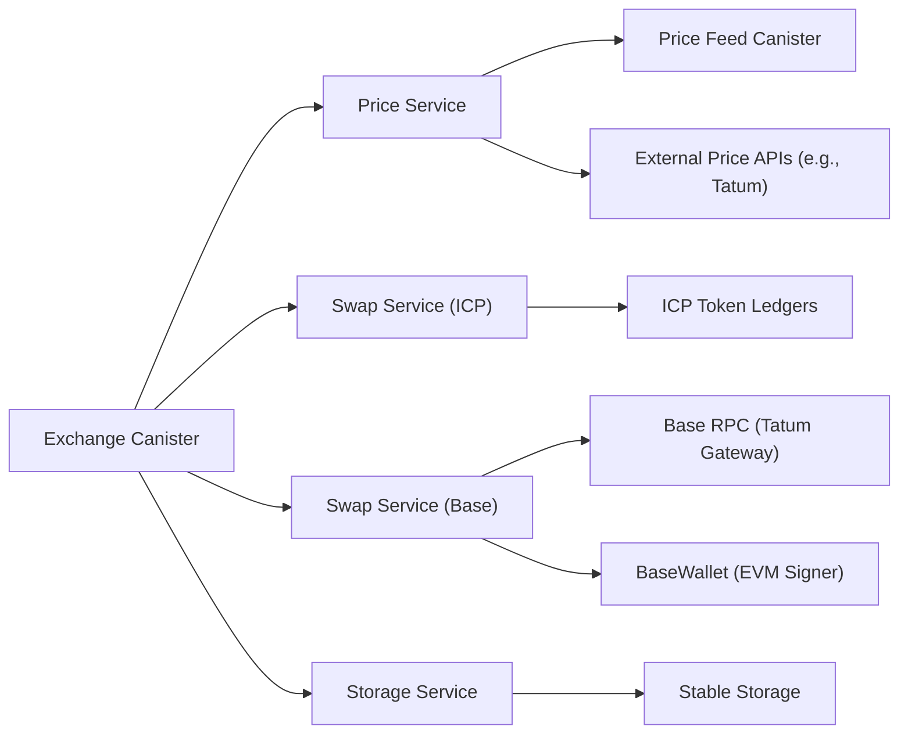
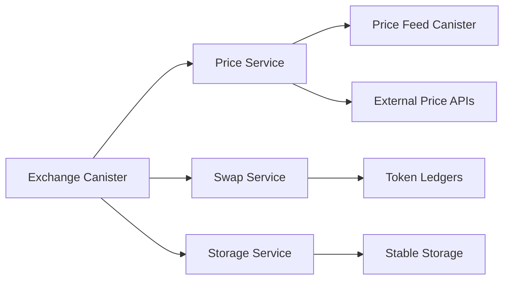
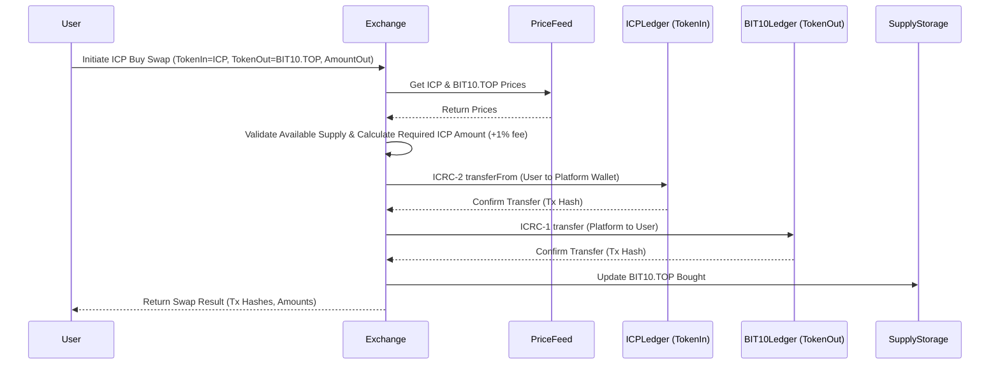
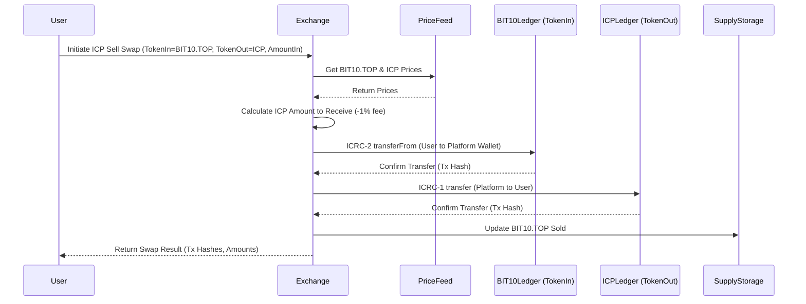
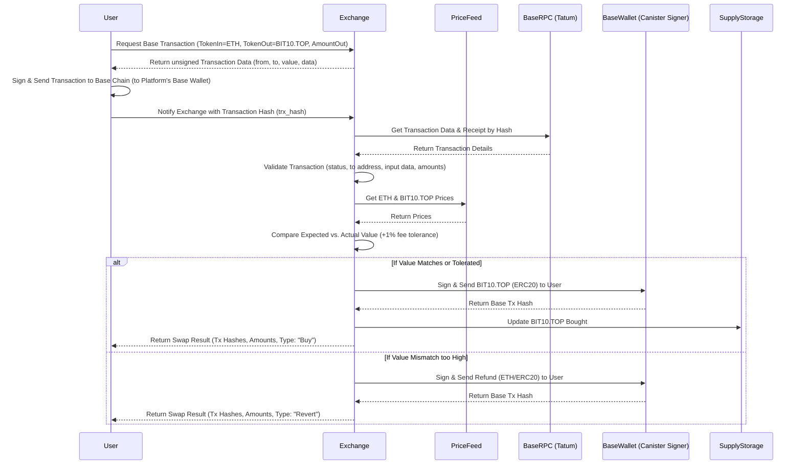

# Mainnet Buy BIT10

Users can swap tokens from ICP, ckBTC, etc. to buy BIT10 tokens on different chains.

## 🌟 Overview

Buy BIT10 is a decentralized exchange protocol built on the Internet Computer Protocol (ICP) that enables users to swap various tokens for BIT10 tokens. The system is designed to be secure, efficient, and user-friendly.

Learn more about Swap in our [GitBook](https://gitbook.bit10.app/part_3/testnet/icp).

## 📐 Architecture Overview



### System Components



### ICP Buy Flow



### ICP Sell Flow



### Base Buy Flow



## 🔗 ICP Canisters

- BIT10 Exchange Canister: [6phs7-6yaaa-aaaap-qpvoq-cai](https://a4gq6-oaaaa-aaaab-qaa4q-cai.raw.icp0.io/?id=6phs7-6yaaa-aaaap-qpvoq-cai)

## 💡 Features

- **Token Swapping**: Swap between various tokens and BIT10 tokens
- **Price Feeds**: Real-time price updates from multiple sources
- **Supply Management**: Automated supply tracking and updates
- **Fee Management**: Transparent fee structure with management and minting fees

## 🔧 Configuration

The system uses several configuration parameters:

- Management Fee: 1% on swaps
- Minting Fee: 1% on reverse swaps

## 🏁 Getting Started

To start using BIT10 Liquidity Hub canister, follow these steps:

1. **Clone the Repository**:
    ```bash
    git clone https://github.com/ZeyaRabani/BIT10.git
    ```

2. **Go to ICP swap folder**:
    ```bash
    cd icp_canister/buy_bit10/mainnet_buy_bit10
    ```

3. **Start the dfx locally and run the canister**:
    ```bash
    dfx start --background
    
    dfx deploy mainnet_buy_bit10_backend
    ```
