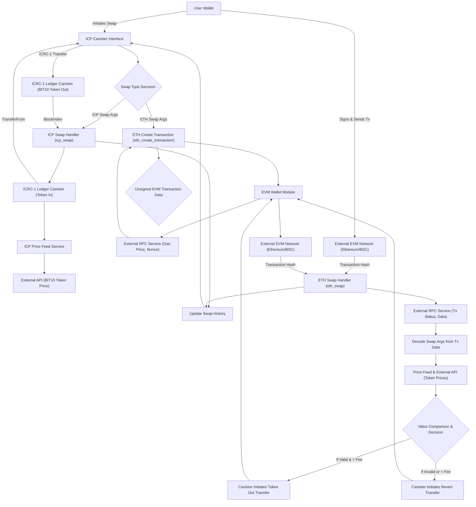

# Testnet Buy BIT10

This project implements a decentralized cross-chain swap mechanism on the Internet Computer (ICP), enabling users to exchange various tokens for BIT10 tokens. Initially, it focuses on facilitating swaps from Ethereum and BSC testnet tokens to BIT10 tokens. The canister acts as an intermediary, managing asset transfers and ensuring secure, transparent, and efficient transactions.

## 🌟 Overview

The BIT10 Cross-Chain Swap Canister provides a robust and secure platform for buying BIT10 tokens. It handles the complexities of interacting with external EVM chains via HTTPS outcalls and manages ICP ledger operations, all while maintaining a comprehensive swap history.

## 🌐 Core Features

- **Multi-Chain Compatibility**: Supports swaps from Ethereum (Sepolia Testnet) and Binance Smart Chain (Testnet).
- **Token Flexibility**: Handles both native blockchain tokens (ETH, tBNB) and ERC-20/BEP-20 standard tokens (e.g., USDC, BTCB).
- **Secure ECDSA Signatures**: Leverages the Internet Computer's native ECDSA signing capabilities for secure transaction signing on external chains.
- **Dynamic Gas Fee Management**: Fetches real-time gas prices to ensure efficient transaction processing on EVM networks.
- **Comprehensive Swap History**: Maintains a persistent record of all swap transactions, queryable by users or addresses.
- **Price Feed Integration**: Integrates with external price oracle canisters to determine fair exchange rates.
- **Transaction Reversion**: Implements a mechanism to revert transactions if swap conditions (e.g., value parity within a tolerance) are not met.

## 📐 Architecture Overview



## 🛠️ System Components

- **ICP Canister Backend (Rust)**: The core logic written in Rust, responsible for handling swap requests, managing state, interacting with other ICP canisters, and making secure HTTP requests to external services.
- **Threshold ECDSA**: ICP's native cryptography service used by the canister to securely sign Ethereum/BSC transactions without exposing private keys.
- **ICRC-1 Ledgers**: Standards-compliant ledger canisters on ICP for managing BIT10 and other ICRC-1 tokens.
- **External Price Feed Service**: An ICP canister (e.g., a data oracle) providing real-time price data for various cryptocurrencies.
- **External EVM RPC Services (Tatum/LlamaRPC)**: Used to query Ethereum/BSC blockchain data (e.g., transaction status, gas prices, nonces) and to broadcast raw signed transactions.
- **User Wallet**: An external wallet (e.g., MetaMask for EVM, Plug Wallet for ICP) used by the user to initiate transactions and hold tokens.

## 🔗 ICP Canisters

- BIT10 Testnet Buy BIT10: [feujt-7iaaa-aaaap-qqc4q-cai](https://a4gq6-oaaaa-aaaab-qaa4q-cai.raw.icp0.io/?id=feujt-7iaaa-aaaap-qqc4q-cai)

## 🏁 Getting Started

To start using BIT10 Testnet Buy BIT10 canister, follow these steps:

1. **Clone the Repository**:
    ```bash
    git clone https://github.com/ZeyaRabani/BIT10.git
    ```

2. **Go to buy_bit10 folder**:
    ```bash
    cd icp_canister/buy_bit10/buy_bit10_testnet_backend
    ```

3. **Start the dfx locally and run the canister**:
    ```bash
    dfx start --background

    dfx deploy buy_bit10_testnet_backend --argument '(opt record {bsc_network = opt variant {Testnet}; ethereum_network = opt variant {Sepolia}; ecdsa_key_name = opt variant {TestKeyLocalDevelopment}})'
    ```
