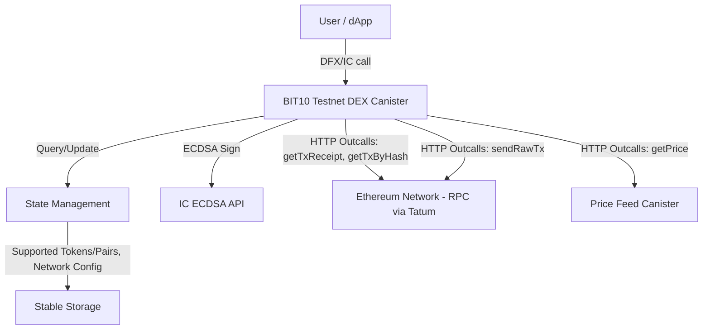

# Testnet DEX Canister

This canister enables decentralized swaps of tokens on the different chain, facilitating trustless exchange within the BIT10 ecosystem. It provides programmatic access to manage assets and execute swaps.

## 🌟 Overview

The BIT10 Testnet DEX Canister acts as a bridge between the different networks, enabling secure custody, management, and decentralized exchange of different tokens. It verifies on-chain transactions and executes corresponding swaps or refunds based on predefined slippage tolerance.

## 🌐 Core Features

- Decentralized Swaps: Facilitates trustless exchange of different tokens.
- Transaction Creation: Creates EIP-1559 compatible Ethereum transactions for token transfers or smart contract interactions (e.g., ERC20 transfer).
- On-chain Verification: Verifies incoming Ethereum transactions (ETH or ERC20 transfers) to the canister.
- Slippage Control: Implements slippage tolerance checks to prevent unfavorable swap execution, automatically initiating refunds if tolerance is exceeded.
- Dynamic Fee Estimation: Fetches real-time gas prices for accurate transaction fee estimation.
- Secure Signature Operations: Utilizes the Internet Computer's ECDSA API for secure transaction signing.

## 📐 Architecture Overview



### 🛠️ System Components

- DEX Canister: The main smart contract containing the core logic for swap execution, transaction verification, fee estimation, and interaction with other services.
- State Management: Manages the canister's internal state, including Ethereum network configuration, ECDSA key details, and custom RPC settings.
- IC ECDSA API: A powerful Internet Computer feature used by the canister to securely sign Ethereum transactions using a derived ECDSA key, without exposing the private key.
- HTTP Outcalls: Enables the canister to make direct HTTP requests to external services, primarily used for:
	- Interacting with Ethereum RPC endpoints (e.g., Tatum API) to get transaction details (receipts, full transaction data), gas prices, and broadcast signed transactions.
	- Fetching real-time token price data from a separate Price Feed Canister.
- Stable Storage: Persists critical data (like the canister's configuration and derived public key information) across canister upgrades, ensuring continuity.

## 🔗 ICP Canisters

- BIT10 Testnet DEX: [vlda4-oaaaa-aaaap-qp7cq-cai](https://a4gq6-oaaaa-aaaab-qaa4q-cai.raw.icp0.io/?id=vlda4-oaaaa-aaaap-qp7cq-cai)

## 🏁 Getting Started

To start using BIT10 DEX canister, follow these steps:

1. **Clone the Repository**:
    ```bash
    git clone https://github.com/ZeyaRabani/BIT10.git
    ```

2. **Go to dex folder**:
    ```bash
    cd icp_canister/dex
    ```

3. **Start the dfx locally and run the canister**:
    ```bash
    dfx start --background

    dfx deploy dex_testnet_canister_backend --argument '(opt record {ethereum_network = opt variant {Sepolia}; ecdsa_key_name = opt variant {TestKeyLocalDevelopment}})'
    ```