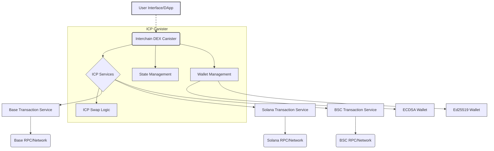

# DEX

A robust cross-chain Decentralized Exchange (DEX) canister built on the Internet Computer Protocol (ICP). This canister enables users to seamlessly swap tokens across multiple blockchain networks.
## 🌟 Overview

The Interchain DEX Canister facilitates token swaps on and between several prominent blockchain networks:

-   **Internet Computer Protocol (ICP)**: Native swaps within the ICP ecosystem.
-   **Base**: Swaps with assets on the Base network.
-   **Solana**: Swaps with assets on the Solana network.
-   **Binance Smart Chain (BSC)**: Swaps with assets on the Binance Smart Chain.

## 📐 Architecture Overview



## 🔗 ICP Canisters

- BIT10 DEX Canister: [bwwo2-dqaaa-aaaap-qqfzq-cai](https://a4gq6-oaaaa-aaaab-qaa4q-cai.raw.icp0.io/?id=bwwo2-dqaaa-aaaap-qqfzq-cai)

## 🔧 Configuration

The system uses several configuration parameters:

- Liquidity Provider Fee: 1% on swaps

## 🏁 Getting Started

To start using BIT10 Testnet DEX BSC Asset Storage canister, follow these steps:

1. **Clone the Repository**:
    ```bash
    git clone https://github.com/ZeyaRabani/BIT10.git
    ```

2. **Go to dex folder**:
    ```bash
    cd icp_canister/dex/mainnet_dex
    ```

3. **Start the dfx locally and run the canister**:
    ```bash
    dfx start --background

    dfx deploy mainnet_dex_backend --argument '(opt record {base_network = opt variant {Sepolia}; bsc_network = opt variant {Testnet}; solana_network = opt variant {Devnet}; ecdsa_key_name = opt variant {TestKeyLocalDevelopment}; ed25519_key_name = opt variant {LocalDevelopment}})'
    ```
