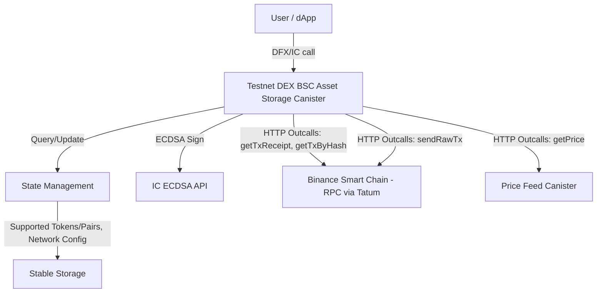

# Testnet DEX BSC Asset Storage Canister

The Testnet DEX BSC Asset Storage Canister is a decentralized component of the BIT10 ecosystem, designed to securely store and manage assets on the Binance Smart Chain (BSC). It enables decentralized swaps, transaction verification, and asset custody, ensuring trustless and efficient operations on the BSC network.

## 🌟 Overview

This canister functions as a secure vault for BSC-based assets, supporting decentralized custody, transaction management, and token swaps. It leverages the Internet Computer's ECDSA API for secure transaction signing and interacts with the BSC network for on-chain verification and execution.

As a core component of the BIT10 ecosystem, the canister ensures seamless and secure asset management while advancing decentralized finance operations.

## 🌐 Core Features

- Secure BSC Asset Storage: Safeguards Binance Smart Chain (BSC) native tokens (e.g., BNB) and BEP20 tokens within the canister.
- Decentralized Swaps: Facilitates trustless token swaps across the BSC network.
- Transaction Creation: Generates EIP-1559 compatible BSC transactions for token transfers or smart contract interactions (e.g., BEP20 transfers).
- On-Chain Verification: Verifies incoming BSC transactions (BNB or BEP20) to ensure validity and correctness.
- Slippage Control: Implements slippage tolerance checks to prevent unfavorable swap execution, automatically initiating refunds if the tolerance is exceeded.
- Dynamic Fee Estimation: Fetches real-time gas prices for accurate transaction fee estimation, ensuring cost-effective operations.
- Secure Signature Operations: Leverages the Internet Computer's ECDSA API for secure transaction signing, ensuring private keys are never exposed.
- Persistent State Management: Stores critical configuration and state data in stable storage to ensure continuity across canister upgrades.

## 📐 Architecture Overview



## 🛠️ System Components

- DEX BSC Asset Storage Canister: The main canister responsible for managing BSC assets, verifying transactions, and executing swaps. Handles transaction creation, slippage control, and interaction with external services.
- State Management: Manages the canister's internal state, including BSC network configuration, supported tokens, and custom RPC settings. Ensures data consistency and integrity during operations.
- IC ECDSA API: A secure signing mechanism provided by the Internet Computer. Allows the canister to sign BSC transactions using a derived ECDSA key without exposing the private key.
- HTTP Outcalls: Enables the canister to interact with external services, such as BSC RPC endpoints and price feeds. Key HTTP outcalls include:
    - BSC RPC: Fetch transaction receipts, transaction details, and broadcast signed transactions.
    - Price Feed Canister: Retrieve real-time token price data for accurate fee estimation and slippage control.
- Stable Storage: Persists critical data, such as the canister's configuration, supported tokens, and derived public key information. Ensures continuity and reliability across canister upgrades.

## 🔗 ICP Canisters

- BIT10 Testnet DEX BSC Asset Storage: [rola4-yaaaa-aaaap-qqbla-cai](https://a4gq6-oaaaa-aaaab-qaa4q-cai.raw.icp0.io/?id=rola4-yaaaa-aaaap-qqbla-cai)

## 🏁 Getting Started

To start using BIT10 Testnet DEX BSC Asset Storage canister, follow these steps:

1. **Clone the Repository**:
    ```bash
    git clone https://github.com/ZeyaRabani/BIT10.git
    ```

2. **Go to dex folder**:
    ```bash
    cd icp_canister/dex/testnet_dex_bsc_asset_storage
    ```

3. **Start the dfx locally and run the canister**:
    ```bash
    dfx start --background

    dfx deploy testnet_dex_bsc_asset_storage_backend --argument '(opt record {bsc_network = opt variant {Testnet}; ecdsa_key_name = opt variant {TestKeyLocalDevelopment}})'
    ```