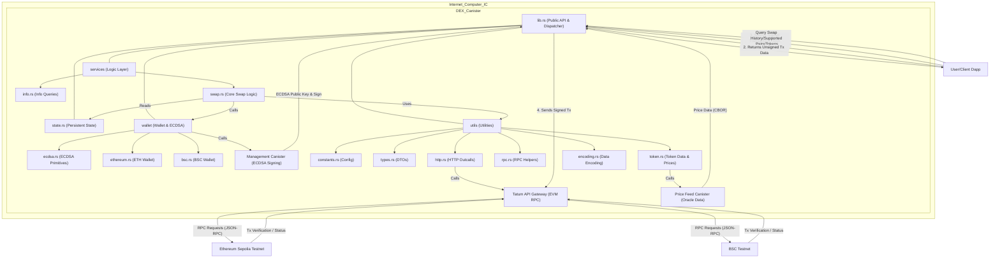

# Testnet DEX BSC ETH Asset Storage Canister

The canister functions as a secure intermediary custodian, enabling trustless cross-chain transfers between BSC and Ethereum. It leverages the Internet Computer’s robust execution environment and ECDSA signing capabilities for transaction verification, secure custody, and efficient settlement.

## 🌟 Overview

This canister is a core component of the cross-chain decentralized exchange (DEX) testnet, operating between Binance Smart Chain Testnet and Ethereum Sepolia. Its primary role is to securely store and manage cryptocurrency assets (native tokens as well as ERC-20/BEP-20 tokens) deposited for cross-chain swaps, verify incoming transactions, and facilitate the outbound transfer of swapped assets to user-specified addresses.

## 🌐 Core Features

- Secure Asset Custody: Safely manages native tokens (tBNB, tETH) and specified ERC-20/BEP-20 tokens deposited by users for swaps. Utilizes the Internet Computer's native ECDSA signing capability for secure private key management and transaction signing.
- Cross-Chain Swap Facilitation: Enables users to initiate swaps between supported tokens on Binance Smart Chain Testnet and Ethereum Sepolia.
- Dynamic Transaction Generation: Provides a `create_transaction` endpoint that generates raw EVM transactions (both native and ERC-20/BEP-20 transfers) with embedded swap metadata, allowing users to sign and submit these transactions from their external wallets.
- Incoming Transaction Verification: The `verify_and_swap` endpoint meticulously validates incoming user deposits on the source chain, ensuring the transaction is successful, correctly addressed to the canister, and includes valid swap parameters.
- Automated Outbound Transfers: Upon successful verification of an incoming deposit, the canister automatically calculates the output amount (considering exchange rates and slippage) and initiates the corresponding transfer of the swapped asset to the user's specified destination wallet on the target chain.
- Slippage Control & Reverts: Implements slippage tolerance checks. If the calculated output amount falls outside the acceptable slippage range, the incoming assets are refunded to the user, and the swap is marked as "reverted."
- Dynamic Gas Fee Estimation: Fetches real-time gas prices (for Ethereum) to ensure transactions are included efficiently on the network.
- Swap History Tracking: Maintains a history of all processed swaps, queryable by pool ID or user wallet address.
- Modular & Extensible Design: Built with a modular architecture to ensure readability, maintainability, and ease of future expansion to support more chains, tokens, or swap types.

## 📐 Architecture Overview



## 🛠️ System Components

- Internet Computer (IC): The underlying blockchain platform hosting the canister, providing secure execution, stable memory, and direct integration with threshold ECDSA signing.
- Management Canister: IC system canister responsible for performing privileged operations like ECDSA public key retrieval and signing.
- HTTP Outcalls: The IC's feature enabling canisters to make arbitrary HTTP requests to external Web2 and Web3 services, used here to interact with blockchain RPC nodes.
- Tatum API Gateway: Used as an external RPC provider for interacting with Ethereum Sepolia and BSC Testnet, providing reliable access to blockchain data.
- Price Feed Canister: An external oracle canister (specified by `PRICE_FEED_CANISTER_ID`) providing real-time price data for supported tokens, crucial for accurate swap calculations and slippage control.
- EVM RPC Canister: An external canister (`EVM_RPC_CANISTER_ID`) to abstract EVM RPC calls, though currently, direct Tatum API calls are used. This component allows for future integration with more generic EVM RPC solutions.
- Alloy: A Rust library for Ethereum development, used for handling EVM transaction structures, signing, and serialization.
- Rust Decimal: A high-precision decimal arithmetic library, used for accurate financial calculations involving token amounts and exchange rates, preventing floating-point inaccuracies.
- Ciborium: A CBOR (Concise Binary Object Representation) serialization/deserialization library, used for decoding price data from the price feed canister.

## 🔗 ICP Canisters

- BIT10 Testnet DEX BSC ETH Asset Storage: [xfcwl-cqaaa-aaaap-qqb4a-cai](https://a4gq6-oaaaa-aaaab-qaa4q-cai.raw.icp0.io/?id=xfcwl-cqaaa-aaaap-qqb4a-cai)

## 🏁 Getting Started

To start using BIT10 Testnet DEX BSC ETH Asset Storage canister, follow these steps:

1. **Clone the Repository**:
    ```bash
    git clone https://github.com/ZeyaRabani/BIT10.git
    ```

2. **Go to dex folder**:
    ```bash
    cd icp_canister/dex/testnet_dex_bsc_eth_asset_storage
    ```

3. **Start the dfx locally and run the canister**:
    ```bash
    dfx start --background

    dfx deploy testnet_dex_bsc_eth_asset_storage_backend --argument '(opt record {ethereum_network = opt variant {Sepolia}; bsc_network = opt variant {Testnet}; ecdsa_key_name = opt variant {TestKeyLocalDevelopment}})'
    ```