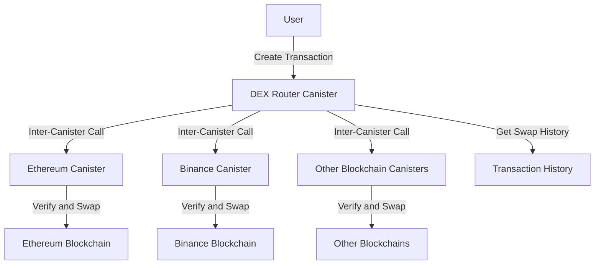

# Testnet DEX Router Canister

The Cross-Chain DEX Router Canister is designed to facilitate seamless token swaps across multiple blockchain networks. It acts as a bridge between different chains, enabling users to perform cross-chain transactions, verify swaps, and retrieve transaction histories in a secure and efficient manner.

## 🌟 Overview

This canister is built on the Internet Computer (IC) and leverages inter-canister calls to interact with other canisters responsible for specific blockchain networks.

## 🌐 Core Features

- Create Transactions: Initiate token swaps by specifying the source and destination chains, token addresses, and amounts.
- Verify and Swap: Verify the status of a transaction and execute the swap if conditions are met.
- Cross-Chain Swaps: Enable token swaps between different blockchain networks.
- Transaction History: Retrieve the history of swaps for a specific wallet address.
- Error Handling: Robust error handling for inter-canister calls and invalid inputs.

## 📐 Architecture Overview



## 🛠️ System Components

- DEX Router Canister: Acts as the main entry point for users. Handles requests for creating transactions, verifying swaps, and retrieving histories.
- Blockchain-Specific Canisters: Each blockchain network (e.g., Ethereum, Binance) has its own canister. These canisters handle the actual token swap logic and interact with their respective blockchains.
- Inter-Canister Communication: The DEX Router Canister communicates with blockchain-specific canisters using inter-canister calls. Principals are used to identify the target canisters.

## 🔗 ICP Canisters

- BIT10 Testnet DEX Router: [t2vfi-5aaaa-aaaap-qqbfa-cai](https://a4gq6-oaaaa-aaaab-qaa4q-cai.raw.icp0.io/?id=t2vfi-5aaaa-aaaap-qqbfa-cai)

## 🏁 Getting Started

To start using BIT10 Testnet DEX Router canister, follow these steps:

1. **Clone the Repository**:
    ```bash
    git clone https://github.com/ZeyaRabani/BIT10.git
    ```

2. **Go to dex folder**:
    ```bash
    cd icp_canister/dex/testnet_dex_router
    ```

3. **Start the dfx locally and run the canister**:
    ```bash
    dfx start --background

    dfx deploy testnet_dex_router_backend
    ```
