```mermaid
graph TD
    subgraph "Frontend (DApp)"
        User[User Interface]
    end

    User -- "1. Lend/Borrow Request (ICP or ETH)" --> LBC_Canister[BIT10 Lending & Borrowing Canister]

    subgraph "BIT10 Lending & Borrowing Canister"
        direction LR

        subgraph "Core Services"
            LB_Logic[Lending & Borrowing Logic]
            EVM_Signer["Ethereum Wallet (tECDSA)"]
            HTTP_Client["HTTP Client (External API Outcalls)"]
        end

        LB_Logic -- "2a. Validate Inputs" --> LBC_Canister
        LB_Logic -- "2b. Get Canister EVM Address" --> EVM_Signer

        LB_Logic -- "3a. Fetch Borrow Token Price (ICP Price Feed)" --> ICP_Price_Feed["ICP Price Feed Canister"]
        LB_Logic -- "3b. Fetch Collateral Token Price (External HTTP API)" --> External_Price_API["External Price API (e.g., BIT10 Backend)"]
        ICP_Price_Feed -- "Price (e.g., USDC)" --> LB_Logic
        External_Price_API -- "Price (e.g., BIT10.TOP)" --> HTTP_Client
        HTTP_Client -- "Forward Price" --> LB_Logic

        subgraph "ICP Interactions"
            direction LR
            Collateral_Ledger_ICP["Collateral Token Ledger (e.g., BIT10.TOP)"]
            Borrowed_Ledger_ICP["Borrowed Token Ledger (e.g., ckUSDC)"]
        end

        subgraph "Ethereum Interactions"
            direction LR
            ETH_RPC["Ethereum RPC (Tatum Gateway)"]
            ETH_Chain["Ethereum Blockchain"]
        end

        LB_Logic -- "4a. (ICP) ICRC-2 transferFrom (Collateral to Canister)" --> Collateral_Ledger_ICP
        LB_Logic -- "4b. (ICP) ICRC-1 transfer (Borrowed Tokens from Canister)" --> Borrowed_Ledger_ICP
        Collateral_Ledger_ICP -- "Block Index / Error" --> LB_Logic
        Borrowed_Ledger_ICP -- "Block Index / Error" --> LB_Logic

        LB_Logic -- "5a. (ETH) Request unsigned Tx Data (Lend)" --> User
        LB_Logic -- "5b. (ETH) Send Tx (Borrow)" --> EVM_Signer
        EVM_Signer -- "Sign Tx" --> ETH_RPC
        ETH_RPC -- "Send Raw Tx" --> ETH_Chain
        ETH_Chain -- "Tx Hash / Error" --> LB_Logic

        LB_Logic -- "6. Respond with Transaction Details" --> LBC_Canister
    end

    LBC_Canister -- "7. Response (Tx Hashes, Status, Rates)" --> User

    style ICP_Price_Feed stroke:#333,stroke-width:2px
    style External_Price_API stroke:#333,stroke-width:2px
    style Collateral_Ledger_ICP stroke:#333,stroke-width:2px
    style Borrowed_Ledger_ICP stroke:#333,stroke-width:2px
    style ETH_RPC stroke:#333,stroke-width:2px
    style ETH_Chain stroke:#333,stroke-width:2px
```

# Testnet Lending and Borrowing Canister

A decentralized lending and borrowing platform built on the Internet Computer, enabling users to leverage their BIT10 tokens as collateral to borrow various assets across different blockchain networks. This canister handles the core logic for managing lending offers and borrowing requests, ensuring secure and transparent financial operations.

## 🌟 Overview

This project provides the backend infrastructure for a cross-chain lending and borrowing protocol, specifically designed to integrate with BIT10 tokens as collateral. The primary goal is to allow users to deposit BIT10 tokens as collateral and borrow other specified tokens, bridging liquidity between the Internet Computer and other supported chains. The canister leverages ICRC-1/ICRC-2 and other token standards for on-chain asset transfers and can interact with external services via secure HTTP outcalls to fetch real-time data like interest rates.

## 🌐 Core Features

- Cross-Chain Collateral & Borrowing: Facilitates lending and borrowing operations where BIT10 tokens (Test BIT10.TOP, Test BIT10.MEME) on the ICP serve as collateral for borrowing other designated assets.
- Dynamic Interest Rates: Integrates with external HTTP APIs via `ic_cdk::api::management_canister::http_request` to fetch real-time interest rates, allowing for flexible and market-driven lending/borrowing terms.
- Robust Input Validation: Ensures all provided Principal IDs (lender, borrower, token ledgers) are valid, preventing common errors and potential vulnerabilities.
- Modular Architecture: Codebase is split into logical modules (`types`, `storage`, `controllers`, `lend_borrow`, `http_client`, `canister_config`) for enhanced maintainability, readability, and scalability.
- Stable Memory Management: Employs `ic-stable-structures` for persistent storage of canister configurations (like controllers), allowing state to survive canister upgrades.

## 📐 Architecture Overview



## 🔗 ICP Canisters

- BIT10 Testnet Cross-Chain Lending and Borrowing: [dp57e-fyaaa-aaaap-qqclq-cai](https://a4gq6-oaaaa-aaaab-qaa4q-cai.raw.icp0.io/?id=dp57e-fyaaa-aaaap-qqclq-cai)

## 🏁 Getting Started

To start using BIT10 Testnet Cross-Chain Lending and Borrowing canister, follow these steps:

1. **Clone the Repository**:
    ```bash
    git clone https://github.com/ZeyaRabani/BIT10.git
    ```

2. **Go to dex folder**:
    ```bash
    cd icp_canister/lending_and_borrowing/testnet_lending_and_borrowing
    ```

3. **Start the dfx locally and run the canister**:
    ```bash
    dfx start --background

    dfx deploy
    ```
