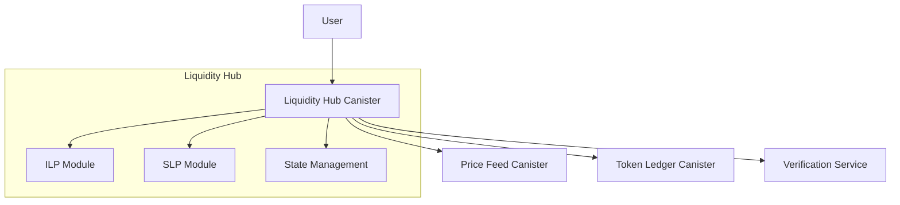
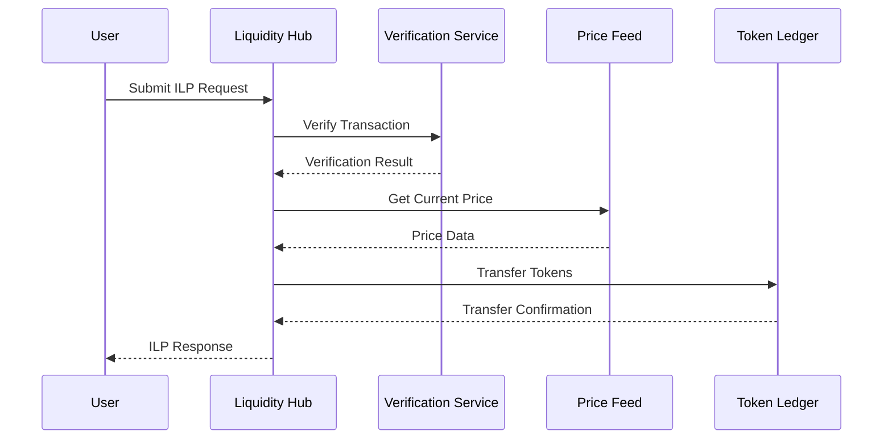
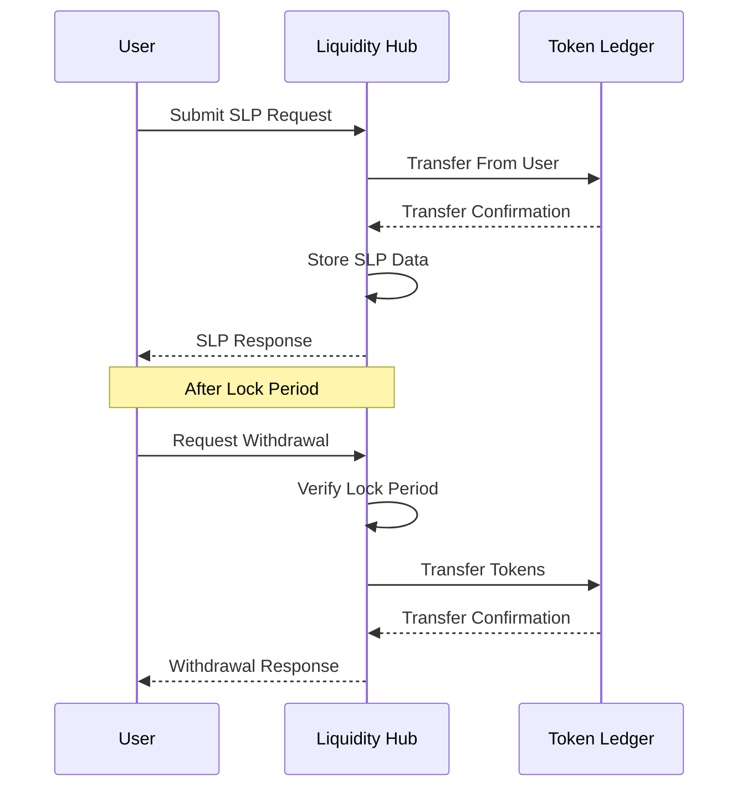

# BIT10 Liquidity Hub

A decentralized liquidity management system for the BIT10 index fund, enabling users to become Authorized Participants (APs) through Instant Liquidity Provider (ILP) and Staked Liquidity Provider (SLP) mechanisms.

## 🌟 Overview

The BIT10 Liquidity Hub is a key component of the BIT10 ecosystem, allowing users to provide liquidity and earn rewards. Authorized Participants (APs) play a crucial role in maintaining the efficiency of the index fund by providing necessary liquidity.

Learn more about Authorized Participants in our [GitBook](https://gitbook.bit10.app/part_4/authorized-participants).

## 🌐 Core Features

### Instant Liquidity Provider (ILP)
- Instant asset swapping with no lock-up period
- Zero fees for transactions
- Direct incentive airdrops
- Real-time price feeds integration
- Support for multiple networks (Bitcoin Testnet, Solana Devnet)

### Staked Liquidity Provider (SLP)
- Flexible staking durations
- Proportional incentive distribution
- Automatic reward calculation
- Secure withdrawal mechanism
- Support for multiple tokens

## 📐 Architecture Overview

### System Components



### ILP Flow



### SLP Flow



## 📂 Code Structure

* **`liquidity_hub/`**

  * `icp/`

    * `testnet_liquidity_hub/` – Canister code for the Liquidity Hub on ICP testnet.

## 🔗 ICP Canisters

- BIT10 Testnet Liquidity Hub: [jskxc-iiaaa-aaaap-qpwrq-cai](https://a4gq6-oaaaa-aaaab-qaa4q-cai.raw.icp0.io/?id=jskxc-iiaaa-aaaap-qpwrq-cai)

## 🏁 Getting Started

To start using BIT10 Liquidity Hub canister, follow these steps:

1. **Clone the Repository**:
    ```bash
    git clone https://github.com/ZeyaRabani/BIT10.git
    ```

2. **Go to liquidity_hub folder**:
    ```bash
    cd liquidity_hub
    ```

3. **Start the dfx locally and run the canister**:
    ```bash
    dfx start --background

    dfx deploy testnet_liquidity_hub_backend
    ```
